# School_District_Analysis

## Overview of Project

### Purpose
The purpose of the school district analysis is to evaluate 15 schools for a variety of factors including but not limited to average student scores for reading/math, average student spending, type of school, performance by grade level, etc. Because the school board determined there's reasonable suspicion that the 9th grade Thomas High School's reading/math scores may have been manipulated, we have been asked in this exercise to alter the scores for Thomas High School's 9th graders to NaN and then evaluate the impact that it has on summary results. 

## Results

### Analysis of School/Student data

**How is the district summary affected?**

District Summary prior to adjustment on Thomas High School:

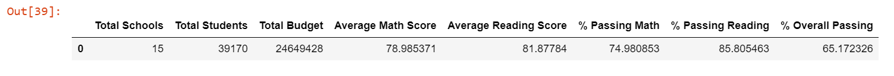  

District Summary after adjustment:

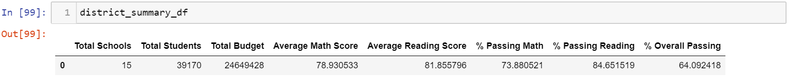

**How is the school summary affected?**

School Summary prior to adjustment on Thomas High School:

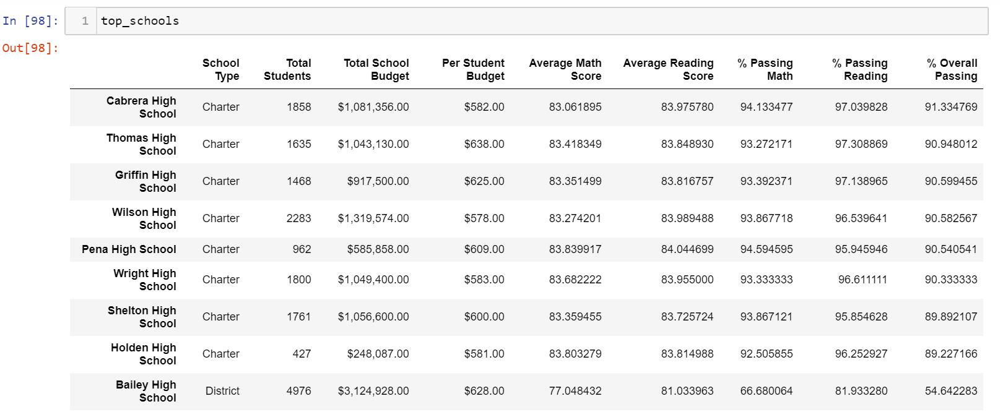 

School Summary after adjustment: 

 

**How does replacing the ninth graders' math and reading scores affect Thomas High School's performance relative to the other schools?** 

**How does repacing the ninth-grade scores affect the following:**

  - **Math and reading scores by grade:** 
      
  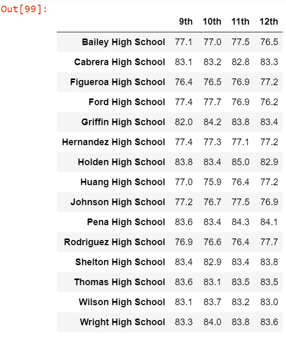 
  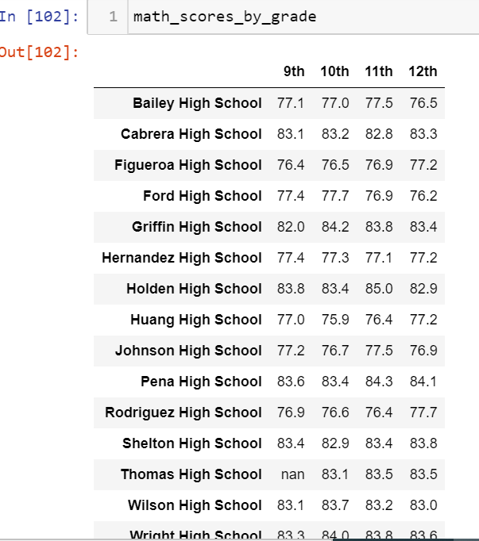 
  
  - **Scores by school spending:**
  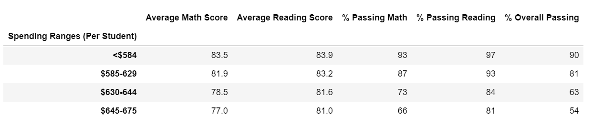 
  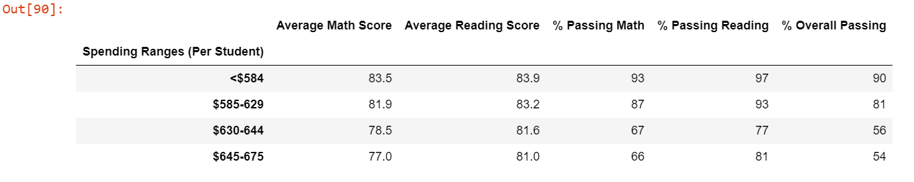 
  
  - **Scores by school size:**
  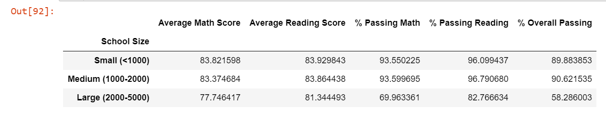 
  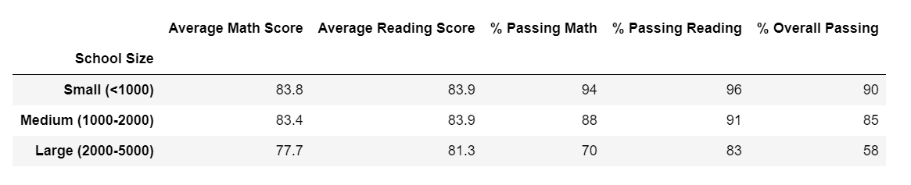
  
  - **Scores by school type:**
  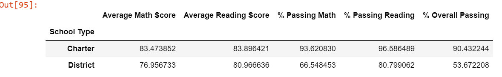 
  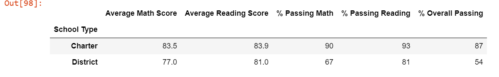
  
## Election-Audit Summary

To the election commission, the above script can be modified in order to analyze data for any given election. For example, the counties can be changed to states, and the candidates may be presidential candidates. We can then utilize a modified version of the script to capture election results for presidential elections instead of congressional elections. In a school election, where the candidate who receives the most popular vote becomes president and the candidate with the second most number of votes becomes vice president, this script can also be modified to address this need. We can modify the output to display both the winner and the runner-up and allocate the president and vice president title based on candidate vote counts accordingly. 
